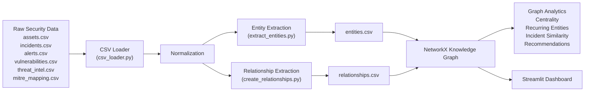

# Incident-Response-Graph


## Context

Incident response data is often scattered across alerts, tickets, analyst notes, and endpoint logs. This leads to Cybersecurity analysts having to manually search through several logs to understand the relationships between users, hosts, ip's and several other entities. The knowledge graph connects these records so analysts can quickly determine whether a new alert is related to prior activity.


## What it is
The Incident Knowledge Platform is a cybersecurity analytics framework that retrieves heterogeneous security telemetry from multiple enterprise security tools, converts it into a canonical security event model, constructs a unified knowledge graph, and applies graph analytics and AI-assisted reasoning to accelerate incident investigation and organizational security intelligence.


## System Architecture 

```text
incident-response-graph/
│
├── data/
│   ├── raw/
│   │   ├── assets.csv
│   │   ├── incidents.csv
│   │   ├── alerts.csv
│   │   ├── vulnerabilities.csv
│   │   ├── threat_intel.csv
│   │   └── mitre_mapping.csv
│   │
│   ├── processed/
│   │   ├── entities.csv
│   │   ├── relationships.csv
│   │   └── normalized_events.csv
│   │
│   └── database/
│       └── incident_graph.db
│
├── src/
│   ├── ingestion/
│   │   ├── csv_loader.py
│   │   ├── scanner_loader.py
│   │   ├── wazuh_loader.py          # Future
│   │   └── security_onion_loader.py # Future
│   │
│   ├── normalization/
│   │   ├── normalize_hosts.py
│   │   ├── normalize_users.py
│   │   ├── normalize_indicators.py
│   │   └── normalize_mitre.py
│   │
│   ├── extraction/
│   │   ├── extract_entities.py
│   │   ├── extract_iocs.py
│   │   └── create_relationships.py
│   │
│   ├── graph/
│   │   ├── build_graph.py
│   │   ├── graph_schema.py
│   │   └── graph_queries.py
│   │
│   ├── analytics/
│   │   ├── recurring_entities.py
│   │   ├── similar_incidents.py
│   │   ├── centrality.py
│   │   └── recommendations.py
│   │
│   ├── dashboard/
│   │   ├── app.py
│   │   ├── search_view.py
│   │   ├── incident_view.py
│   │   └── graph_view.py
│   │
│   ├── config.py
│   └── database.py
│
├── tests/
│   ├── test_ingestion.py
│   ├── test_normalization.py
│   ├── test_graph_build.py
│   └── test_similarity.py
│
├── output/
│   ├── incident_graph.html
│   └── analyst_summary.csv
│
├── requirements.txt
├── README.md
└── run_pipeline.py
```

## Data Pipeline

The Incident Knowledge Graph follows a modular data engineering pipeline that transforms raw cybersecurity data into a graph structure suitable for analytics and investigation.

Raw datasets are first ingested and normalized into a consistent format. From these normalized datasets, entities (assets, incidents, alerts, vulnerabilities, indicators, etc.) and their relationships are extracted and stored as structured CSV files. These files are then used to construct a NetworkX knowledge graph that supports graph analytics, similarity analysis, recommendations, and dashboard visualization.



### Pipeline Stages

| Stage | Purpose |
|--------|---------|
| **Ingestion** | Load raw cybersecurity datasets into pandas DataFrames. |
| **Normalization** | Standardize hostnames, IPs, domains, timestamps, CVE identifiers, MITRE techniques, and other fields across data sources. |
| **Entity Extraction** | Create canonical graph nodes representing assets, incidents, alerts, indicators, vulnerabilities, and MITRE techniques. |
| **Relationship Extraction** | Build edges that describe how entities are connected (e.g., Incident → Asset, Alert → IP, Asset → CVE). |
| **Graph Construction** | Build a directed NetworkX knowledge graph from extracted entities and relationships. |
| **Analytics** | Perform graph-based analysis including centrality, recurring entities, incident similarity, and recommendation generation. |
| **Dashboard** | Provide an interactive investigation interface using Streamlit and PyVis. |

---


## Graph Schema

### Node Types

| Node | Description |
|------|-------------|
| **Asset** | Servers, workstations, laptops, cloud resources, or other managed endpoints. |
| **Incident** | Security investigations or case records. |
| **Alert** | Individual detections associated with an incident. |
| **Process** | Executables or processes observed during an alert. |
| **IP** | IP addresses observed in alerts or threat intelligence. |
| **Domain** | Domains contacted during malicious activity. |
| **Hash** | File hashes associated with suspicious or malicious files. |
| **CVE** | Known software vulnerabilities affecting assets. |
| **Threat Indicator** | Indicators of compromise collected from threat intelligence feeds. |
| **MITRE Technique** | MITRE ATT&CK techniques associated with observed attacker behavior. |

### Relationship Types

| Relationship | Meaning |
|-------------|---------|
| **INVOLVES_ASSET** | Incident affects an asset. |
| **HAS_ALERT** | Incident contains one or more alerts. |
| **OBSERVED_ON_ASSET** | Alert occurred on a specific asset. |
| **CONTACTED_IP** | Alert communicated with an IP address. |
| **CONTACTED_DOMAIN** | Alert communicated with a domain. |
| **EXECUTED_PROCESS** | Alert involved a process or executable. |
| **INVOLVED_HASH** | Alert referenced a file hash. |
| **MAPS_TO_MITRE** | Alert corresponds to a MITRE ATT&CK technique. |
| **MATCHES_THREAT_INTEL** | Alert matches an external threat intelligence indicator. |
| **HAS_VULNERABILITY** | Asset is affected by a CVE. |
| **CAN_MAP_TO_MITRE** | Process is associated with a MITRE ATT&CK technique. |

## Overview


## Graph Visualization


## Requirements

The Incident Knowledge Graph MVP has been developed and tested using Python 3.11+ and relies on several open-source libraries for data processing, graph analytics, visualization, and dashboard development.

### Software Requirements

- Python 3.11 or newer
- Git
- pip (Python package manager)

### Python Dependencies

The project dependencies are listed in `requirements.txt` and include:

| Package | Purpose |
|----------|---------|
| pandas | Data ingestion and preprocessing |
| networkx | Knowledge graph construction and graph analytics |
| pyvis | Interactive graph visualization |
| streamlit | Interactive dashboard |
| scikit-learn | Similarity analysis (future expansion) |
| matplotlib | Supporting visualizations (optional) |
| plotly | Interactive charts (future dashboard enhancements) |

Install all dependencies using:

```bash
pip install -r requirements.txt
```


---

## Installation & Setup

### 1. Clone the Repository

```bash
git clone https://github.com/philtchoko/incident-knowledge-graph.git

cd incident-knowledge-graph
```

---

### 2. Install Dependencies

```bash
pip install -r requirements.txt
```

---


### 3. Populate the Raw Data Directory

Place the required CSV datasets inside:

```text
data/raw/
```

The MVP expects the following files:

```text
assets.csv
incidents.csv
alerts.csv
vulnerabilities.csv
threat_intel.csv
mitre_mapping.csv
```

These datasets may be generated from synthetic data, public cybersecurity datasets, or future integrations with enterprise security tools.

---

### 4. Run the Data Pipeline

Execute the complete pipeline:

```bash
python run_pipeline.py
```
The pipeline will automatically:

- Load and normalize all datasets
- Extract entities and relationships
- Build the NetworkX knowledge graph
- Generate graph analytics
- Produce analyst recommendation outputs
- Export an interactive graph visualization

Generated outputs include:

```text
data/
└── processed/
    ├── entities.csv
    └── relationships.csv

output/
├── incident_graph.html
├── top_degree_entities.csv
├── top_betweenness_entities.csv
├── recurring_entities.csv
├── entities_connected_to_multiple_incidents.csv
├── similar_incidents.csv
└── recommendations.csv
```

---
### 5. Launch the Dashboard

Once the pipeline has completed successfully, start the Streamlit dashboard:

```bash
streamlit run src/dashboard/app.py
```

The dashboard provides several investigation views, including:

- **Overview**
  - Graph statistics
  - Centrality analysis
  - Recurring entities

- **Entity Search**
  - Search any asset, incident, alert, IP, domain, CVE, or MITRE technique
  - View connected entities
  - Generate analyst recommendations

- **Incident Investigation**
  - Explore individual incidents
  - Discover similar incidents
  - Inspect neighboring entities

- **Graph Visualization**
  - Interactive PyVis visualization of the investigation graph

---


